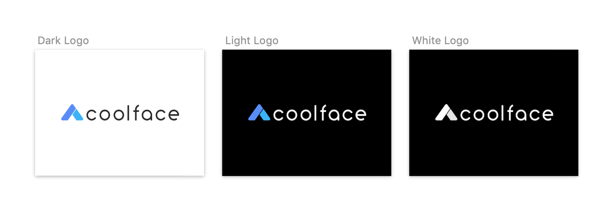

# CoolFace - App

CoolFace 是一家專業的露營用品出租店。
本專案的目標是打造一個輕量的iOS APP, 讓使用者可以於App中以更簡潔的流程，瀏覽商品及完成訂購。

此外，為了實作UI/UX設計流程，在這個專案中規劃了資訊架構、User flow、User story、Wireframe、Style Guide、UI Design、Logo Design 及High fidelity 的Prototype。

## 資訊架構 
  [Information Architecture](IA.png)
  

## User flow
  [User flow](UserFlow.png)
  
  

## User story

###   Tab Bar
	1. 使用者可以使用Tab Bar切換不同頁面（Home/ Products/Cart/ Orders/Profile)

###   Login
	1. 使用者再進入Cart 結帳頁面/Orders/Profile 之前需要先註冊/登入
	2. 使用者可以使用email, FB 與Google註冊或登入
	3. 使用者可以點選忘記密碼按鈕，寄送密碼至註冊的email

###   Home
	1. 使用者在Home可以選擇租借開始與歸還日期後，進入Product頁面(開始日的預設值為今日日期+7日，歸還日為今日日期+9日）
	2. 使用者可以在Home點選News 連結，以modal瀏覽
###   Product
	1. 使用者在product頁面可以瀏覽物品清單
	2. 使用者可以點選清單在modal中查看product detail
	3. 使用者可以在modal將物品加入購物車，加入後會有成功的提示
	4. 使用者在product頁面可以將物品清單向左滑動，點選購物車icon將物品加入購物車中，加入後會有成功的提示
	5. 使用者在product頁面可以編輯租借日期，更改後會有成功的提示
	6. 使用者更改日期後，租借物品的清單價格會隨著租借天數自動計算租金總額
	7. 使用者在product頁面可以選擇不同分類(category)的icon跳制該分類的物品
###   Cart
	1. 使用者在Cart頁面可以編輯租借日期，更改後會有成功的提示，物品會根據天數自動計算價格
	2. 使用者在Cart頁面可以更改各物品的數量，價格會根據數量自動計算價格
	3. 使用者在Cart頁面點擊物品，可以瀏覽物品明細
	4. 使用者在Cart頁面點選登入後，會自動帶入帳號相關的姓名、電話、地址作為送貨地址
	5. 使用者在Cart頁面按下Confirm會成立訂單
###   Order
	1. 使用者在Order頁面可以瀏覽所有訂單概要
	2. 使用者在Order頁面可以點擊單一訂單，在modal中瀏覽Order明細狀態
	3. 使用者可以在Order明細的modal中點擊Pay按鈕付款（連至第三方付款頁面）
###   Profile
	1. 使用者可以在Profile頁面更改除email之外的個人資訊
	2. 使用者在Profile頁面登出

## Wireframe
  [Wireframe](wireframe.png)
  

## Style Guide
  [Colors](Colors.png)  
   
  [Typography](Typography-Dark.png)
  
  (please see sketch file for detail spec)
  
## Logo
  [Logo](Logo.png)
  
  
## Prototype
  [Prototype](https://projects.invisionapp.com/share/U5T17318316AQ7#/screens)

